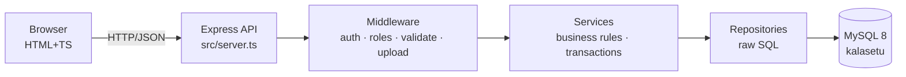

# KalaSetu — Tribal Handicrafts Marketplace

> **Kala** (art) + **Setu** (bridge): a bridge between tribal artisans and the world.

   

A full-stack e-commerce platform where tribal artisans display and sell authentic handicrafts to customers and global businesses, with **cultural authenticity verification** built into the product lifecycle. Built as a professional portfolio project demonstrating layered architecture, raw SQL mastery, and purpose-driven design.

---

## Architecture

```
Browser (HTML + Vanilla TS)
       │  REST API (JSON)
       ▼
Express 4 + TypeScript 5
       │  Service layer (business rules)
       ▼
Repository layer (raw SQL via mysql2)
       │  Parameterized queries only
       ▼
MySQL 8 (InnoDB, utf8mb4)
```



---

## Features

### 👑 Admin
- User management: activate artisans, suspend accounts, create consultants
- Platform-wide coupon creation, product featuring, delisting
- KPI dashboard: GMV, orders/day, top categories/artisans, user growth (Chart.js)
- Support ticket triage and resolution
- Category management

### 🏺 Artisan
- Create/edit product listings with up to 5 images
- Submit for authenticity review; re-verification on content edits
- Manage orders: mark Confirmed → Shipped → Delivered
- Heritage page: tribe, region, craft tradition, personal story
- B2B bulk inquiry responses with quoted unit price and lead time
- Sales dashboard: revenue chart, top products, order count

### ✔ Cultural Consultant
- Review queue of PENDING_REVIEW listings
- Approve (grants Authentic badge + attach cultural notes) or reject with feedback
- Review history

### 🛒 Customer
- Shop with search, filter by category/price, sort by newest/price/rating
- Product detail: gallery, Authentic badge, cultural heritage notes, verified reviews
- Cart, wishlist, coupon application, address checkout
- Mock payment (Card/UPI/COD) with simulate-failure for demo
- Order history with status timeline
- Message artisans directly
- Raise support tickets
- B2B bulk inquiry submission (business accounts)

---

## Database ER Summary

| Table | Purpose |
|---|---|
| `users` | All roles (ADMIN/ARTISAN/CUSTOMER/CONSULTANT) |
| `artisan_profiles` | Heritage data: tribe, region, story |
| `categories` | Product categories |
| `products` | Listings with status lifecycle |
| `product_images` | Gallery images per product |
| `verification_reviews` | Consultant approve/reject decisions |
| `cart_items` / `wishlist_items` | Shopping state |
| `coupons` | Platform-wide + artisan shop coupons |
| `orders` / `order_items` / `payments` | Transactional order lifecycle |
| `reviews` | Verified-purchase reviews only |
| `conversations` / `messages` | Customer↔artisan messaging |
| `bulk_inquiries` / `inquiry_quotes` | B2B wholesale workflow |
| `support_tickets` | Customer/artisan → admin support |
| `notifications` | In-app bell: order, review, quote, message events |

---

## Local Setup

### Prerequisites
- Node.js 20+
- MySQL 8 (or MySQL Workbench with local server)

### 1. Database
```sql
-- In MySQL Workbench or mysql CLI:
source db/schema.sql   -- creates `kalasetu` database + all tables
source db/seed.sql     -- loads demo data
```

### 2. Environment
```bash
cp .env.example .env
# Edit .env: set DB_PASSWORD if needed
```

### 3. Install & Run
```bash
npm install
npm run build            # compile backend TS → dist/
npm run build:frontend   # compile frontend TS → public/js/
npm start                # production
# OR
npm run dev              # ts-node-dev hot-reload
```

Server starts at **http://localhost:3000**

### 4. Re-seed (reset demo data)
```bash
npm run seed
```

---

## Demo Credentials

All passwords: **`Admin@123`**

| Role | Email | Notes |
|---|---|---|
| Admin | admin@kalasetu.in | Full platform access |
| Consultant | consultant@kalasetu.in | Review queue access |
| Artisan | ramesh@kalasetu.in | Dhokra metal casting, Bastar |
| Artisan | lalita@kalasetu.in | Warli painting, Maharashtra |
| Artisan | suresh@kalasetu.in | Gond painting, Madhya Pradesh |
| Artisan | kamla@kalasetu.in | Lambani embroidery, Karnataka |
| Customer | customer1@kalasetu.in | Regular buyer (Ananya Mehta) |
| Customer | customer2@kalasetu.in | Regular buyer (Vikram Joshi) |
| Business | business@kalasetu.in | Terra Decor Imports (B2B) |

---

## Design System — "Mud & Metal"

Inspired by Warli painting geometry, Dhokra bronze, and indigo-dyed textiles.

| Token | Colour | Use |
|---|---|---|
| `--ink` | `#231A15` | Primary text, nav/footer |
| `--mud` | `#8A5A33` | Borders, section backgrounds |
| `--bronze` | `#B0782B` | Primary buttons, prices |
| `--indigo` | `#2E4057` | Secondary actions, page headers |
| `--bone` | `#F1E8DA` | Page background |
| `--leaf` | `#5C7C4C` | Authentic badge, success states |

Signature element: **Warli figure frieze** — SVG strip of stick figures and triangular dancers used as section dividers across every page.

---

## Project Structure

```
kalasetu/
├── db/
│   ├── schema.sql          # full MySQL schema (run in Workbench)
│   └── seed.sql            # demo data with real craft traditions
├── src/                    # backend TypeScript
│   ├── server.ts
│   ├── config/db.ts        # mysql2 pool
│   ├── middleware/         # auth, roles, errorHandler, upload, validate
│   ├── routes/             # one file per module
│   ├── services/           # business rules + transactions
│   ├── repositories/       # ALL SQL lives here
│   ├── utils/              # jwt, slugify, orderNumber, notify
│   └── types/index.ts      # shared interfaces & enums
├── frontend-src/           # vanilla TypeScript source
│   ├── lib/                # api, auth, layout, toast, format
│   └── pages/              # one module per page
├── public/                 # compiled frontend + static assets
│   ├── *.html + artisan/ consultant/ admin/
│   ├── css/                # shared.css + page CSS
│   └── js/                 # tsc output (never edit directly)
├── .env.example
└── package.json
```

---

## Roadmap / Learning Path

1. **Prisma migration** — replace `repositories/*` with Prisma client; `prisma db pull` introspects the existing schema. The route → controller → service → repository layering makes this a repositories-only change.
2. **Razorpay integration** — replace mock payment service with Razorpay test-mode.
3. **Order-item-level fulfillment** — per-artisan shipping status within multi-artisan orders.
4. **Hindi/Telugu i18n** — `i18next` with language toggle.
5. **Image optimization** — `sharp` for resize/compress on upload.

---

## Design Decisions

- **Raw SQL over ORM**: Owner is learning database fundamentals via MySQL Workbench. Parameterized queries in a dedicated repository layer make a future Prisma migration a contained change.
- **httpOnly cookie JWT**: Prevents XSS token theft; `sameSite: lax` protects against CSRF for the primary use case.
- **Transactional order placement**: Stock decrement, order creation, coupon increment, and cart clear happen in one MySQL transaction — rollback on any failure.
- **Re-verification on content edits**: Editing an APPROVED product's name/description/technique resets it to PENDING_REVIEW. Price and stock edits keep approval (they don't affect cultural authenticity).
- **Verified Purchase reviews**: Only customers with a DELIVERED order containing that product can review — enforced at the SQL query level, not just UI.
- **Mock payment with simulate-failure**: The checkout demo is realistic enough for portfolio presentation and correctly exercises the stock-restore rollback path on failure.
